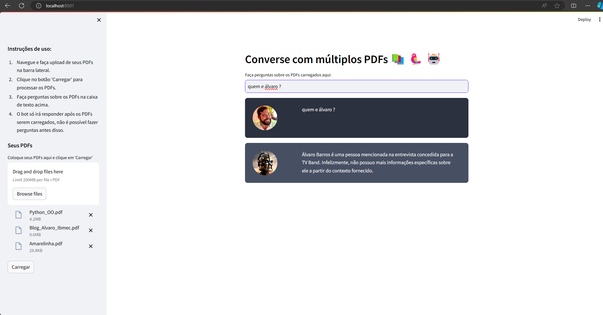
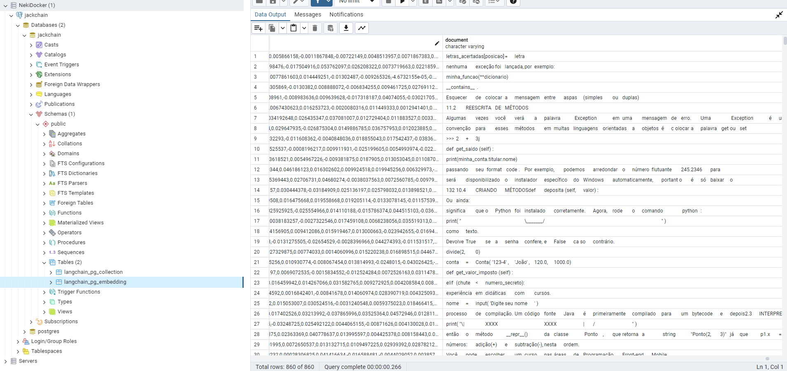
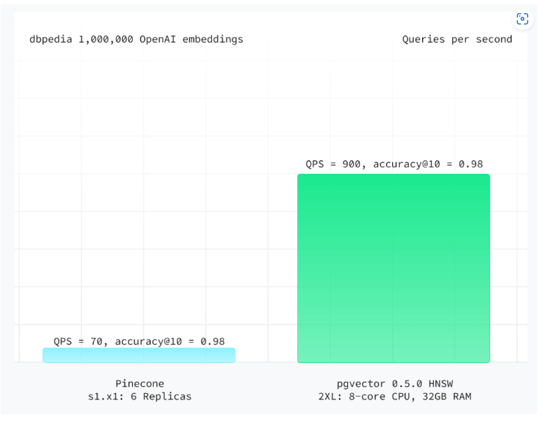

**Projeto NEKI PDFs Conversa com IA** 📚🤖🦜

*Caso queira ver apenas o [resultado final](#resultado-final)*

**Objetivo do Projeto:**
O projeto NEKI PDFs Conversa com IA permite interagir com conteúdos de arquivos PDF utilizando uma interface web criada com Streamlit e tecnologias de IA para extrair e responder perguntas sobre o texto. Tudo isso operado dentro de contêineres Docker para uma instalação e execução simplificadas. 😎

**Pré-requisitos:**
Antes de embarcar nessa jornada, você precisará instalar:
1. **Docker**: [Instale Docker aqui](https://docs.docker.com/get-docker/)
2. **Docker Compose**: [Instale Docker Compose aqui](https://docs.docker.com/compose/install/) (caso não esteja incluído no Docker).

*Acredito que o Compose já venha instalado com o docker, mas não custa nada colocar aqui.*

**Configuração Inicial:**
1. **Clonagem do Repositório**:
   - Clone o repositório para obter os arquivos necessários.
   ```bash
   git clone [URL_DO_REPOSITÓRIO]
   cd [NOME_DO_DIRETÓRIO]
   ```

2. **Verifique os Arquivos de Configuração**:
   - Certifique-se que `docker-compose.yml`, `Dockerfile` e `environment.yml` estão presentes e configurados corretamente.

**Como Executar o Projeto:**
1. **Construa e Inicie o Projeto com Docker Compose**:
   ```bash
   docker-compose up --build
   ```
   - Este comando constrói as imagens Docker e inicia os serviços.

2. **Acesse a Interface do Streamlit**:
   - Visite `http://localhost:8501` para interagir com a aplicação.

3. **Utilização**:
   - **Carregar PDFs**: Faça upload dos PDFs que deseja analisar.
   - **Iniciar Conversa**: Digite perguntas na interface para obter respostas baseadas nos textos dos PDFs.

**Solução de Problemas:**
- Verifique a conexão com o banco de dados e a presença de todos os arquivos necessários. Certifique-se de que os caminhos nos arquivos de configuração estão corretos.

**Integração com pgAdmin para Gerenciamento de Dados:**
1. **Instalação do pgAdmin**: [Baixe e instale o pgAdmin](https://www.pgadmin.org/download/)
2. **Configuração e Conexão**:
   - Conecte-se ao banco de dados PostgreSQL dentro do Docker.
   - Configure os parâmetros de conexão com base nas suas configurações do `docker-compose.yml`.

3. **Verificação dos Dados**:
   - Use o pgAdmin para explorar e gerenciar os dados armazenados no PostgreSQL.

Com estas etapas, você estará pronto para explorar o mundo fascinante dos PDFs conversacionais com IA! 🧙‍♂️💬

---

**Sugestões Rápidas:**
- **A:** Não se esqueça de verificar a configuração do firewall se estiver enfrentando problemas de conexão.
- **B:** Experimente diferentes tipos de perguntas para ver como a IA lida com os dados extraídos dos PDFs.
- **C:** Caso tenha dúvidas sobre o PGVector e como fazer queries dos embeddings dentro do PGAdmin, sugiro olhar a documentação do [PGVector](https://github.com/pgvector/pgvector) e do [LangChain](https://python.langchain.com/docs/integrations/vectorstores/pgvector/)

👍 O Streamlit pode apresentar alguns bugs caso você tente, foi utilizado devido ao fácil desenvolvimento para a prova de conceito. 👍

---

# Resultado Final

### Testando Query após carregar os PDFs


### Mostrando através do pgAdmin os dados persistindo após gerar os embeddings


\
\
\


### Um dos motivos que me levaram a testar o PGVector ao invés do Pinecone por exemplo

